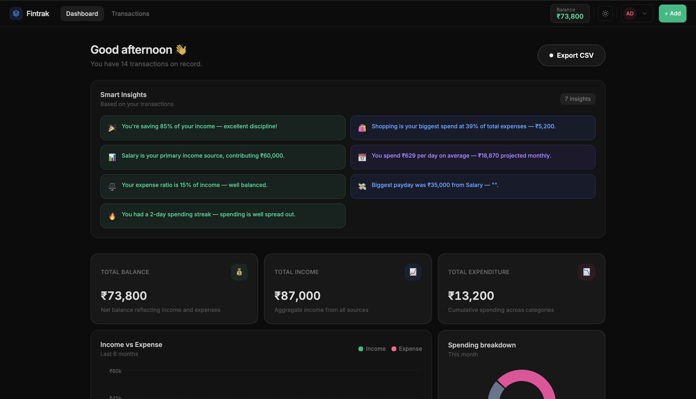
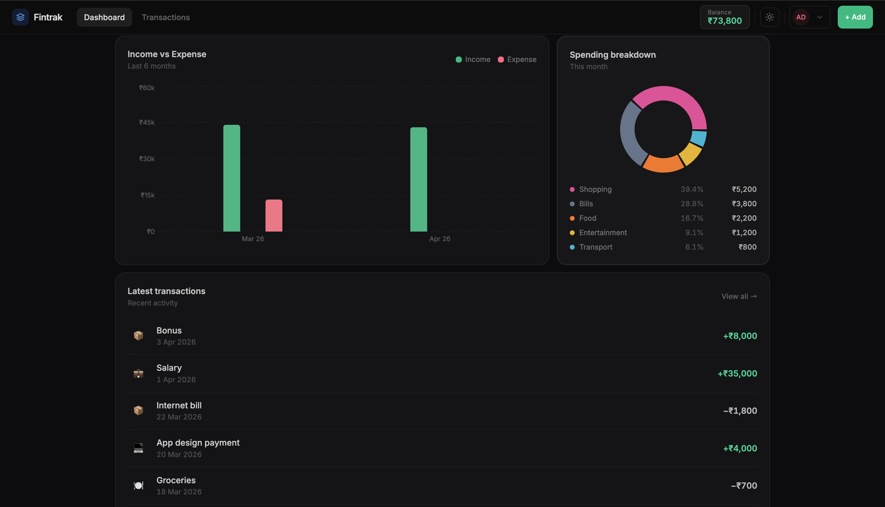
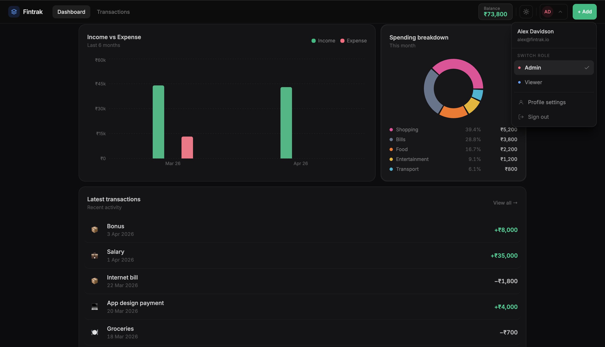
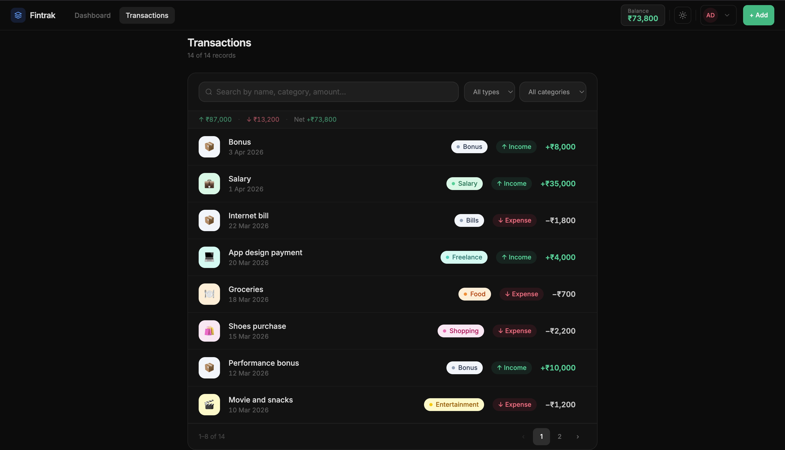

# Fintrak — Smart Finance Dashboard 💰

> Not just a dashboard — a clean, insight-driven financial experience.

---

## 🚀 Live Demo

👉 https://your-link.vercel.app

---

## 🧠 The Idea

Most finance dashboards show numbers.  
**Fintrak goes one step further — it explains them.**

This project focuses on turning raw financial data into **clear, meaningful insights** while maintaining a smooth and premium user experience.

---

## ✨ What makes this different?

Instead of just showing charts, Fintrak answers:

- Where is your money going?
- Are you saving enough?
- What patterns exist in your spending?

---

## 📊 Features

### Dashboard

- Real-time balance, income, and expense overview
- Time-based and category-based visualizations
- Clean and distraction-free layout

### Smart Insights Engine 🔥

Automatically analyzes user data and generates insights like:

- Savings rate
- Expense-to-income ratio
- Highest spending category
- Average daily spending
- Spending streak detection
- Income source contribution

> This is the core highlight of the project.

---

### Transactions Management

- Add, edit, delete transactions (full CRUD)
- Smart filtering (type + category)
- Real-time search
- Pagination for scalability

---

### Role-Based UI

- **Admin** → full control
- **Viewer** → read-only mode

Simulated role switching to demonstrate UI behavior.

---

### UX & Polish

- Dark mode
- Smooth scrolling using Lenis
- Micro-interactions and subtle animations
- Fully responsive design
- Thoughtful spacing and typography

---

### Data Handling

- Persistent data using LocalStorage
- State managed via Redux Toolkit
- Automatic sync between UI and storage

---

### Export

- Download transactions as CSV

---

## 🛠 Tech Stack

- React
- Redux Toolkit
- Tailwind CSS
- Recharts
- Lenis
- LocalStorage

---

## 📸 Preview

### Dashboard





### Transaction



---

## ⚙️ Setup

```bash
git clone https://github.com/abhijeet432005/fintrak.git
cd fintrak
npm install
npm run dev
```
